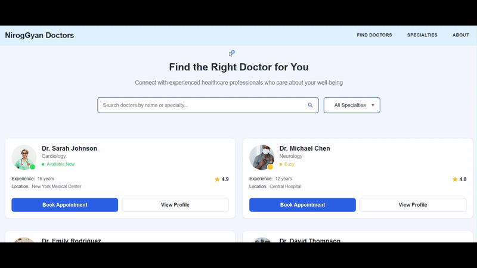

# 🩺 Doctor Appointment Booking App

A React application for browsing doctors and booking appointments. Built with React Router and inline styling using JavaScript, this app features dynamic routing, detailed doctor pages, and appointment confirmation flows.

---

## 🚀 Features

- 🔍 Search for doctors by name or specialty
- 📄 View detailed doctor profiles
- 📅 Book appointments with a confirmation page
- 🔁 Navigate between pages using React Router
- 🎨 Inline styles written in JavaScript (no external CSS files)

---

## 📦 Tech Stack

- **React**
- **React Router**
- **Inline JavaScript Styles**
- **Local JSON data (`doctorsdata.json`)**

---

## 📁 Folder Structure

```
src/
├── components/
│ ├── BookAppointment
│ │ └── index.js # Booking form with inline styling
│ ├── DoctorCard
│ │ └── index.js # Each Doctor Profile with inline styling
│ ├── DoctorFinder
│ │ └── index.js # Main Home Page with inline styling
│ ├── DoctorGrid
│ │ └── index.js 
│ ├── DoctorProfile
│ │ └── index.js # Doctor Profile Page of individual doctor
│ ├── Footer
│ │ └── index.js # Footer with inline styling
│ ├── Header
│ │ └── index.js # Header with inline styling
│ ├── HeroSection
│ │ └── index.js # Search and Filter control Section
│ ├── SearchInput
│ │ └── index.js # Search Doctor section
│ └── SpecialtyFilter
│   └── index.js # Filter section to Filter Doctors
├── data/
│ └── doctorsdata.json # Doctor mock data
├── App.js
├── index.js

```

---

## 📸 Screenshots



---

## 📌 Key Routes
```
| Path               | Description              |
| ------------------ | ------------------------ |
| `/`                | Home - Find a Doctor     |
| `/doctor/:id`      | Doctor Profile Page      |
| `/doctor/:id/book` | Appointment Booking Page |
```
---

## 🔧 Improvements with More Time
- Form validation with error messages.
- Add pagination or lazy loading for doctors.
- Connect to real backend (Node.js/Express or Firebase).
- Add authentication and appointment history.

---

## 🧩 Challenges Faced
- Handling route params in profile page.
- Managing state between filters and doctor list.
- Ensuring component reusability and responsiveness.

---

## 📬 Feedback or Suggestions
If you have any suggestions, feel free to reach out!